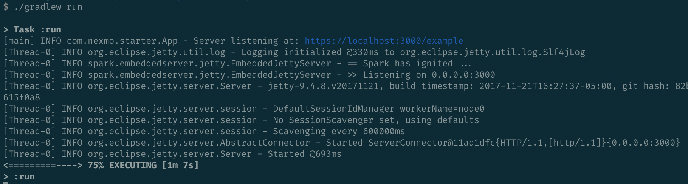

# ⚠️ This repository is no longer maintained.


## Support Notice
This is an archived repository. If you have any questions, feel free to reach out to us at devrel@vonage.com or through our Community Slack at https://developer.vonage.com/community/slack.

<hr />

## Spark Starter Kotlin

This repository contains code that can be used to integrate the [Nexmo Java Client Library](https://github.com/Nexmo/nexmo-java) and the [Spark Framework](http://sparkjava.com/).

### Deploy to Heroku
[](https://nexmo.dev/nexmo-spark-kotlin-heroku)

### How to Use
First clone the repository into a directory of your choosing:

```sh
git clone https://github.com/nexmo-community/spark-starter-kotlin.git
```

Now navigate to the directory and start the application using [Gradle](https://gradle.org/).

Linux, Mac:
```sh
./gradlew run
```

Windows:
```sh
./gradlew.bat run
```



### How to Modify

All of the code can be found in the `com.nexmo.starter.App` class:

```kotlin
package com.nexmo.starter

import spark.kotlin.*

class App

fun main() {
    // Set the listening port to 3000
    port(3000)

    // Register the routes
    get("/example") { "Hello world!" }
    post("/example") { "Hello world!" }
}
```

This class sets up a route listening for a GET and a route listening for a POST request on the `https://localhost:3000/example` path.

Any `String` that you return in each `Route` will be sent back to the user.

### Responding with an NCCO

The [Nexmo Voice API](https://developer.nexmo.com/voice/voice-api/overview) uses [Nexmo Call Control Objects (NCCO)](https://developer.nexmo.com/voice/voice-api/guides/ncco) to modify the flow of a call.

For example, if you wanted to create a voice proxy (where you connect your Nexmo number to another number), you can modify `App` to this:

```kotlin
package com.nexmo.starter

import com.nexmo.client.voice.ncco.ConnectAction
import com.nexmo.client.voice.ncco.Ncco
import com.nexmo.client.voice.ncco.PhoneEndpoint
import com.nexmo.client.voice.ncco.TalkAction
import spark.kotlin.*

class App

const val RECIPIENT_NUMBER = "15555551234"
const val NEXMO_NUMBER = "18885551234"

fun main() {
    port(3000)
    get("/webhooks/answer") {
        val intro = TalkAction.Builder("Please wait while we connect you").build()
        val connect = ConnectAction
                .Builder(PhoneEndpoint.Builder(RECIPIENT_NUMBER).build())
                .from(NEXMO_NUMBER)
                .build()

        type("application/json")
        Ncco(intro, connect).toJson()
    }
}
```

From here you would then use something like [ngrok](https://ngrok.com/) to expose your server.

## More Information
For more information:
- Nexmo: https://developer.nexmo.com
- Spark Framework: http://sparkjava.com/


